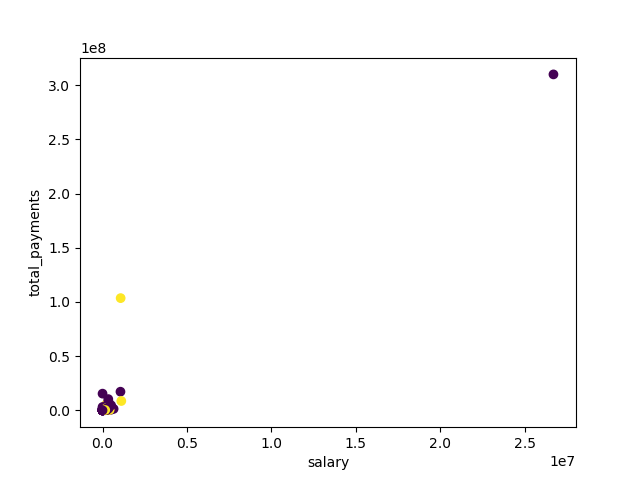

# Analysing the Enron dataset 
## Intro to Machine Learning project by Andras Somi

## Assignment questions
### 1. Summarize for us the goal of this project and how machine learning is useful in trying to accomplish it.

> As part of your answer, give some background on the dataset and how it can be used to answer the project question. Were there any outliers in the data when you got it, and how did you handle those?  [relevant rubric items: “data exploration”, “outlier investigation”]

#### Background

The goal of this project is to create a classifier to identify persons of interests in the infamous Enron scandal, based on some details on their remuneration and a dataset consisting many of their incoming and outgoing email messages.

Supervised machine learning is extremely well suited for this type of issues in general. In the numerical data there are no obvious differences between ‘poi’ and ‘non-poi’ datapoints that would let us dissect the two groups manually, while the text data contains vast amout of emails that can only be processed in an automated fashion.

In this specific case we might also hit some of the limits of machine learning though. The dataset consists of rather few persons, 145 in total, of which only 18 is labelled as ‘poi’. The small number of obsevations might make any solutions prone to overfitting, especially when using text-analysis techniques, which can produce vast number of additional features.

#### The data

The dataset contains financial and email data about 145 persons related to the Enron scandal. Not all features are present though for every individual in the dataset.

```
<class 'pandas.core.frame.DataFrame'>
Index: 145 entries, ALLEN PHILLIP K to YEAP SOON
Data columns (total 21 columns):
bonus                        81 non-null float64
deferral_payments            38 non-null float64
deferred_income              48 non-null float64
director_fees                16 non-null float64
email_address                111 non-null object
exercised_stock_options      101 non-null float64
expenses                     94 non-null float64
from_messages                86 non-null float64
from_poi_to_this_person      86 non-null float64
from_this_person_to_poi      86 non-null float64
loan_advances                3 non-null float64
long_term_incentive          65 non-null float64
other                        92 non-null float64
poi                          145 non-null bool
restricted_stock             109 non-null float64
restricted_stock_deferred    17 non-null float64
salary                       94 non-null float64
shared_receipt_with_poi      86 non-null float64
to_messages                  86 non-null float64
total_payments               124 non-null float64
total_stock_value            125 non-null float64
dtypes: bool(1), float64(19), object(1)
memory usage: 23.9+ KB
```

#### Outliers

I found one obvious outlier, as the original dataset contains an entry named 'TOTAL' for summing up the financial data. We have to exclude this from the analysis.

I found no other outliers. For some financial features a few persons does show rather high or low values, but nothing extreme, and log-transforming these variables (as it’s usually useful with financial type features) make these points more or less fit into the distributions.



### 2. What features did you end up using in your POI identifier, and what selection process did you use to pick them? Did you have to do any scaling? Why or why not? 

> As part of the assignment, you should attempt to engineer your own feature that does not come ready-made in the dataset -- explain what feature you tried to make, and the rationale behind it. (You do not necessarily have to use it in the final analysis, only engineer and test it.) In your feature selection step, if you used an algorithm like a decision tree, please also give the feature importances of the features that you use, and if you used an automated feature selection function like SelectKBest, please report the feature scores and reasons for your choice of parameter values.  [relevant rubric items: “create new features”, “intelligently select features”, “properly scale features”]

As we have rather limited number of observations in the dataset I started by finding out which features are the most frequent among the data points, assuming that the best candidates for being used in a model as these cover the most datapoints.

### 3. What algorithm did you end up using? What other one(s) did you try? How did model performance differ between algorithms?  

> [relevant rubric item: “pick an algorithm”]


### 4. What does it mean to tune the parameters of an algorithm, and what can happen if you don’t do this well?  How did you tune the parameters of your particular algorithm? What parameters did you tune? 

> (Some algorithms do not have parameters that you need to tune -- if this is the case for the one you picked, identify and briefly explain how you would have done it for the model that was not your final choice or a different model that does utilize parameter tuning, e.g. a decision tree classifier).  [relevant rubric items: “discuss parameter tuning”, “tune the algorithm”]

### 5. What is validation, and what’s a classic mistake you can make if you do it wrong? How did you validate your analysis?  
> [relevant rubric items: “discuss validation”, “validation strategy”]

### 6. Give at least 2 evaluation metrics and your average performance for each of them. Explain an interpretation of your metrics that says something human-understandable about your algorithm’s performance. 
> [relevant rubric item: “usage of evaluation metrics”]

## References

1. Text feature extraction: [http://scikit-learn.org/stable/modules/feature_extraction.html#text-feature-extraction](http://scikit-learn.org/stable/modules/feature_extraction.html#text-feature-extraction)
2. Classification of text documents using sparse features: [http://scikit-learn.org/stable/auto_examples/text/document_classification_20newsgroups.html](http://scikit-learn.org/stable/auto_examples/text/document_classification_20newsgroups.html)
3. Pipeline: chaining estimators: [http://scikit-learn.org/stable/modules/pipeline.html](http://scikit-learn.org/stable/modules/pipeline.html)
4. Pipeline example: [http://scikit-learn.org/stable/auto_examples/plot_digits_pipe.html#sphx-glr-auto-examples-plot-digits-pipe-py](http://scikit-learn.org/stable/auto_examples/plot_digits_pipe.html#sphx-glr-auto-examples-plot-digits-pipe-py)
5. 